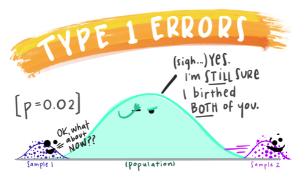

```{r setup, include=FALSE}
knitr::opts_chunk$set(echo = TRUE)
library(data.table)
library(ggplot2)
```

## Agenda

* Look at some cool stuff for the confidence interval
* Z value and T value
* T distribution
* Aligning Equation blocks in R markdown
* QQ-plots

## Confidence Interval things

This amazing visualization [(link)](https://rpsychologist.com/d3/ci/) is worth your time to dive into. It gives intuitive sense of the convoluted explanation/definition of what the "95 percent"" in a 95 percent confidence interval means. 

*It means that if you construct a bunch of intervals constructed in this perscribed manner, 95 percent of them will contain the true mean. (But, what does that mean? Click the link to find out!)*

## The Z value (and the T value)

What Z value is associated with a 95 percent confidence interval? It's `r qnorm(2.5/100)`!

What if we wanted the 80 percent confidence interval for the mean (drawing from a normal propulation)? The Z value is just going to be `r qnorm(0.1)` !!!

What if we have a small sample size (say 12 samples), we aren't sure that it's a normal population(**we are almost ALWAYS unsure it's normal**) and we want the 83 percent confidence interval? We're going to use the T distribution. The **T** value is just going to be: `r (qt((1-.83)/2, 12-1))` 

```{r, results='hide'}
qnorm(2.5/100)

qnorm(0.1)

qt((1-.83)/2, 12-1)
```

What are these Z and T values? They are **the number of standard deviations away from the mean that define your confidence interval**. 

## The T distribution

How's the T distribution different than the normal distribution? Basically it's got heavier tails. However, you can see that it approaches the normal distribution as the degrees of freedom increase. By the time you hit 100 degrees of freedom, you would be hard pressed to tell the difference between the two. 

```{r t distribution, echo=FALSE}

d <- data.table(xpts= seq(-4,4,by=0.1))

d[,norm:=dnorm(xpts)]

ds <- c(1,2, 5, 10, 25, 50, 100)

for(ii in ds){
    d[,paste("t",ii,sep=""):=dt(xpts,df = ii)]
}

ggplot() + 
  geom_line(data = d, aes(x = xpts, y = norm), color = "red") +
  geom_line(data = d, aes(x = xpts, y = t1), color = "black") +
  geom_line(data = d, aes(x = xpts, y = t2), color = "dimgrey") +
  geom_line(data = d, aes(x = xpts, y = t5), color = "darkgrey") +
  geom_line(data = d, aes(x = xpts, y = t10), color = "grey") + 
  geom_line(data = d, aes(x = xpts, y = t25), color = "lightgrey") 
```


## Test - labeled


1. Test Statistic (T-Statistic in the case of the t-test)
2. P value (all of the yellow+green area) (in this case our p value is greater than alpha. We do not reject the null)
3. Alpha values (all of the green) (type 1 error rate. The rate that we reject the null when the null is actually true.)
4. Rejection Threshold (`qnorm(alpha/2)`)

## Type 1 and Type 2 Errors

Fun images from Alison Horst of UCSB ([link to her github](https://github.com/allisonhorst/stats-illustrations))

### Type 1 Error



Probability that you reject the null (you reject equality) when you shouldn't 

### Type 2 error


Probability that you fail to reject the null when you should

## Two-tailed versus One-tailed testing

You just always do 2 tailed testing. Because that's the way that it's done across scientific fields. Across industries. It's a similar level of sacrosanct as the 5 precent alpha. It's basically a universally agreed upon convention. If you deviate from it, people will look at you werid and be disinclined to trust your findings.

Practical reasons you might want a 2 tailed test.

* You can still report surprising results that come out opposite of what you were expecting.

## Aligning Equations in R Latex

Here are 2 good ways to create nice aligned equations in Rmd documents. Note that the `&` symbol is where they align. I always put it before the $=$ or $\leq$ or $\approx$, but, you can actually put it wherever (it's just a little uncouth).

You can use: `\begin{align}` outside of the `$$` latex environment 

\begin{align}
2x - 5y &=  8 \\
3x + 9y &=  -12 \\
\\
N &\geq (5 + 3) \cdot 8 \\
&\geq (8) \cdot 8 \\
&\geq 64
\end{align}

You can also use `\begin{aligned}` inside the `$$` environment. 

* This is my personal preference becasue you get the in R-studio rendering. 

$$
\begin{aligned}
2x - 5y &=  8 \\
3x + 9y &=  -12 \\
\\
N &\geq (5 + 3) \cdot 8 \\
&\geq (8) \cdot 8 \\
&\geq 64
\end{aligned}
$$

**Do NOT** use `\begin{align}` inside the `$$` or you will end up with some undiagnosable errors knitting and compiling.

## QQ Plot

These allow us to asses the normality or lack thereof of a sample. 

If the data is very normaly distributed, then we'll get a diagonal line as below: 

```{r, echo = FALSE}
a <- rnorm(15737, mean =50, sd=5)

qqnorm(a)
```

But what is a QQplot actually doing? QQ plots are essentially a scatter plot. First the points that you pass are sorted in order. Then plotted relative to the orginal input data on the Y axis, and the values as they would appear if they were normally distributed are on the X axis.

Drilling down to the end points of a plot. The Y value of the end point is the actual smallest value in your sample. The X values are spaced so that they contain equal probability between them on the normal distribution. The probability to the end point is half of that. So, if we plot a 20 point sample. We expect the lowest x value to be -1.96 $= (1/20)*0.5$, the next x value should be `r qnorm((1/20)*1.5)` $=(1/20)*1.5$. Indeed that's what we see. 

```{r}
a <- rnorm(20, mean =50, sd=5)

qqnorm(a)
```

If the data has heaver tails than a normal, the tails on the plot will curve vertically as below:

```{r, echo = FALSE}
a <- rt(3000,3)

qqnorm(a)
```

If the data isn't as spread out, then we get the opposite effect

```{r,echo=FALSE}
a <- runif(3000)

qqnorm(a)
```

We can do qq plots with other distributions if we want. Here's the t-curve with 1 degree of freedom compared with the normal curve.

```{r}
#ppoints makes the quantiles that you plug into a given distribution. It's used under the hood in qqnorm()
  #Try running ppoints(20)
ppoints(20)

#say we have some data (in this case the data follows a 3 df t distribution)
d <- rt(3000, df=3)

#get the length of the data
n_spl <- length(d)

#get equally spaced cumulative probabiliies
spaces <- ppoints(n_spl)

#get the T values associated with those cumulative probabilites
  # note the '.' is treated like any other character in R. It's like a '_'
t.dist.3.degree <- qt(spaces,df=3)

qqplot(x=t.dist.3.degree, y=d)


```

## More information

* I like this video [(link)](https://www.khanacademy.org/math/ap-statistics/estimating-confidence-ap/one-sample-z-interval-proportion/v/conditions-for-valid-confidence-intervals) on the confidence interval from Khan Acaemy
  * Note, we have not used these exact assumptions for the Student's T confidence interval in this class. 
* Hiding your output and whatnot in R https://bookdown.org/yihui/rmarkdown-cookbook/hide-one.html
* This page from university of virginia was helpful for qqplot stuff https://data.library.virginia.edu/understanding-q-q-plots/