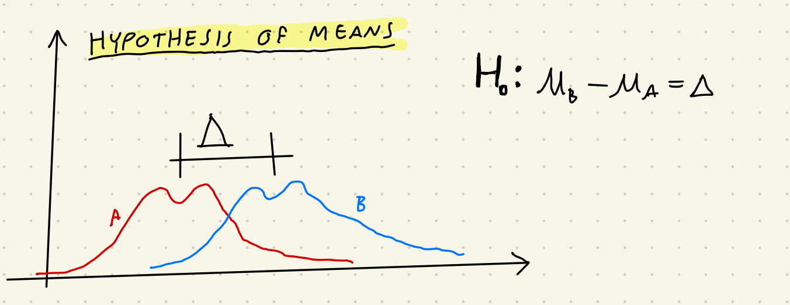
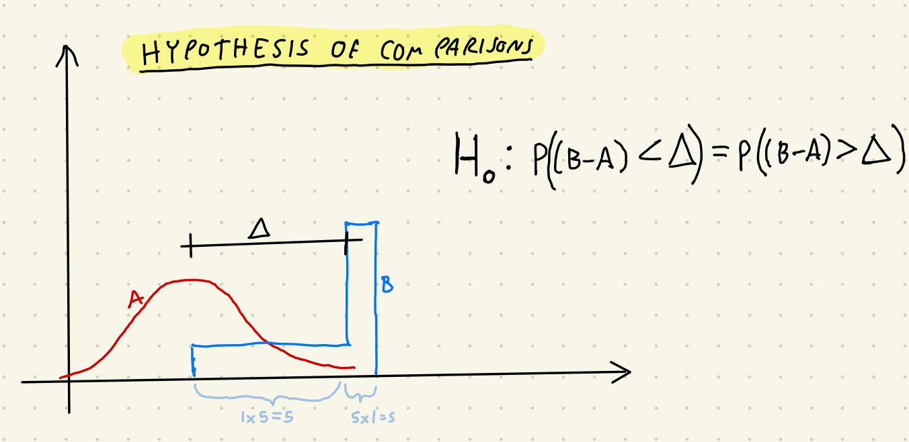

```{r setup, include=FALSE}
knitr::opts_chunk$set(echo = TRUE)

library(data.table)
```

## Agenda

* Test requirements (underlying assumptions)
* Wilcoxon Hyp of Means vs. Hyp of Comparisons
* Lab 1 things

## Where we've been, where we're going.

## Test Requirements

#### Table of test applicablility:

  - UT - Unpaired t-test
  - PT - Paired t-test
  - W(M) - Wilcoxon Rank-Sum Test (Hypothesis of Means)
  - W(C) - Wilcoxon Rank-Sum Test (Hypothesis of Comparisons)
  - WSR - Wilcoxon Signed rank Test
  - ST - Sign Test

| Condition                                 | UT | PT | W(M) | W(C) | WSR | ST |
| ----------------------------------------- | -- | -- | ---- | ---- | --- | -- |
| Metric Scale                              | x  | x  | x    |      | x   |    |
| Paired Dependent Samples                  |    | x  |      |      | x   | x  |
| X & Y identcally distributed except means |    |    | x    |      |     |    |
| Sample means apprx. normal                | x  |    |      |      |     |    |
| Diff. btwn. X & Y is apprx. normal        |    | x  |      |      |     |    |
| Diff. btwn. X & Y is symmetric abt. mean  |    |    |      |      | x   |    |
| Sample (or pair) is drawn i.i.d.          | x  | x  | x    | x    | x   | x  |

## Two sample t-test

$$
T = \frac{\bar{X} - \bar{Y} - (\mu_1 - \mu_2)}{\sqrt{\frac{S_1^2}{m} + \frac{S_2^2}{n}}}
$$

$$
\nu = \frac{\left( (se_1)^2 + (se_2)^2 \right)^2}{\frac{(se_1)^4}{m-1}  + \frac{(se_2)^4}{n-1}}
\\ \
\\ \
\\
se_1 = \frac{s_1}{\sqrt{n}}, se_2 = \frac{s_2}{\sqrt{n}}
$$


```{r}
set.seed(46290)

t.test.mu.se <- function(mu1, se1, n1, mu2, se2, n2){
  # perform a 2 sided, 2 sample t test given summary statistics for sample.
    # null hypothesis is that there is no difference
    # formulas are from Devore 8th Ed p 357
  
  t_stat <- ((mu1 - mu2) - (0))/sqrt(se1**2 + se2**2)
  d_free <- round((se1**2 + se2**2)**2/((se1**4/(n1-1)) + (se2**4/(n2-1))))
  p_val <- pt(-abs(t_stat),df = d_free) * 2
  
  res <- list(t_stat,d_free,p_val)
  names(res) <- c("t_stat", "d_free", "p_val")
  
  return(res)
}

mu1 <- 5.0
mu2 <- 5.5 
sd1 <- 5
sd2 <- 5
n1 <- 60
n2 <- 60
se1 <- sd1/sqrt(n1)
se2 <- sd2/sqrt(n2)

data1 <- rnorm(n1, mean = mu1, sd = sd1)  
data2 <- rnorm(n2, mean = mu2, sd = sd2)

mu1_2 <- mean(data1)
mu2_2 <- mean(data2)
sd1_2 <- sqrt(var(data1))
sd2_2 <- sqrt(var(data2))
se1_2 <- sd1_2/sqrt(n1)
se2_2 <- sd2_2/sqrt(n2)

print(t.test.mu.se(mu1,se1,n1,mu2,se2,n2))
print(t.test(data1,data2))
print(t.test.mu.se(mu1_2,se1_2,n1,mu2_2,se2_2,n2))
```

The t-test tells you about samples. If you put your populations in there. It's kind of a non-sensiscal thing. There is no probability that the means are different. They just are different. That's why the first t-test doesn't match the other ones. Probbably if you re-ran this a bunch of times then the average p-value for your samples and your average difference would converge to my non-sensical first t-test's values, but I don't actually know, becase I haven't done that. (I can't give extra credit, but I can offer you glory if you run the thing in a loop and tell me what happens.)

## Wilcoxon Rank Sum 

#### Hypothesis of means....

* Identially distributed populations
* Metric variable
* Sample points drawn i.i.d 



```{r}

wilcox.rank.sum.mean.test <- function(d1,d2){

  # takes 2 data vectors returns W score
  d <- data.table(dset = c(rep(1,length(d1)),rep(2,length(d2))), ddata = c(d1,d2))
  d <- d[order(ddata)]
  d <- d[,raw_rank:=seq(1,.N)]
  d <- d[,adj_rank:= as.numeric(raw_rank)] # for fill in adj rank with raw rank
  #adj rank needs to be as.numeric so that it doesn't get coerced to int.
  
  #actually calculate out the adjusted ranks
  for(ii in 1:(nrow(d)-1)){
    if(d[ii,ddata] ==  d[ii+1,ddata]){
      d[ddata == d[ii,ddata], adj_rank:=mean(raw_rank)]
    }   
  }

  # calc test statistics
  w1 <- d[dset == 1, sum(adj_rank) - sum(seq(1,.N))] # sample 1 test statistic
  w2 <- d[dset == 2, sum(adj_rank) - sum(seq(1,.N))] # sample 2 test statistic
    # the ".N" is just the length of the sequence we pull
  
  p_val1 <- (pwilcox(as.numeric(w1),length(d1),length(d2)) + 
            pwilcox(as.numeric(w2),length(d1),length(d2),lower.tail = FALSE))
  
  p_val2 <- (pwilcox(as.numeric(w1),length(d1),length(d2)) * 2)
  
  res <- list(w1,p_val1)
  names(res) <- c("W", "p_val")
  return(res)
}

print(wilcox.rank.sum.mean.test(data1,data2))

print(wilcox.test(data1,data2))
```

#### Hypothesis of Comparisons...

* Ordinal Variable
* Sample points drawn i.i.d 



```{r}
wilcox.rank.sum.compare.test <- function(d1,d2){
  # takes 2 data vectors returns W score per hypothesis of comparisons
  
  d <- data.table(d1=rep(d1,each=length(d2)),d2 = rep(d2,times=length(d1)))
  # make all posssible combos of d1 & d2 put it in a data.table
  
  # calc test statistics
  w1 <- nrow(d[d1 > d2,]) + nrow(d[d1 == d2,])/2 # data1 > data2 test statistic
  w2 <- nrow(d[d2 > d1,]) + nrow(d[d1 == d2,])/2 # data2 > data1 test statistic

  #just force w1 to be the smaller of w1, w2
  if(w1 > w2){
    temp <- w1
    w1 <- w2
    w2 <- temp
  }
  
  p_val1 <- (pwilcox(as.numeric(w1),length(d1),length(d2)) + 
            pwilcox(as.numeric(w2),length(d1),length(d2),lower.tail = FALSE))
  
  p_val2 <- (pwilcox(as.numeric(w1),length(d1),length(d2)) * 2)
  
  res <- list(w1,p_val1)
  names(res) <- c("W", "p_val")
  return(res)
}

print(wilcox.rank.sum.compare.test(data1,data2))
# note we get the exact same answer 

print(wilcox.test(data1,data2))
```

#### Comparing means and comparisons

For our float data sets (~ no ties) the hypothesis of comparisons and method of means produce exactly the same results. Even though we gave them a different theoretical underpinning and went about calculating them with what look like different methods, they are mathematically equivalent. The interpretation is just different. 

* **Hypothesis of means** we are trying to reject the null hypothesis that the means of $X$ and $Y$ are exactly equal. 
  * *More precisely, the null hypothesis is that the means differ exactly by some value ($\Delta$). In practice we are almost always checking if they differ at all ($\Delta = 0$)*
  * This stronger null hypothesis comes with the associated assumptions.
* **Hypothesis of comparisons** we are trying to reject the null hypothesis that the probabiity of getting a draw where $X > Y$ is the same as the probability of getting a draw where $X < Y$.  $(P(X<Y) = P(X>Y))$ 
  * *More precisely, the null hypothesis is that $P(X+\Delta > Y) = P(X+\Delta <Y)$. In practice $\Delta$ is almost always zero.*
  * With this weaker null hypothesis, we lose information on the actual means, but we get to drop the restricive assumptions.
  * This is kind of **similar** to a comparison of medians for the distribution, and that's what my drawing looks like, (but **it's NOT actually comparing the medians** since all points are compared to all other points)
    * For example if $X$ = {-2,0,2} & $Y$ = {-1,-1,3} then the median of $Y$ (-1) is lower than the median of $X$ (0), but the $P(y>x) > P(x>y)$ [$P(y>x) = 5/9$; $P(x>y) = 4/9$] (see table below)
    * The tricky thing is that all points are being compared to all other points. It's difficult to collapse down to summary statistics that the mind likes to work with.
    
```{r, echo = FALSE}
e1 <- c(-2,0,2)
e2 <- c(-1,-1,3)

e <- data.table(x=rep(e1,each=length(e2)),y = rep(e2,times=length(e1)))
e <- cbind(e, e[,.("x > y" = (x > y)*1, "y > x" = (y > x)*1)])

knitr::kable(e,format="markdown")
```
  
```{r}
# Note: we still get the same interpetation and consistency of methods when we move to integer data. 

data1_int <- as.integer(data1)
data2_int <- as.integer(data2) 

print(wilcox.rank.sum.mean.test(data1_int,data2_int))
print(wilcox.test(data1_int,data2_int))
print(wilcox.rank.sum.compare.test(data1_int,data2_int))
```

## Lab 1 General notes

* See below. Operationalization is a big thrust of the lab. 

### Variable Operationalization 

Operationalizing variables is basically concretely defining how you are going to represent your conceptual question with data. There’s usually several ways that you could go about it. I’m going to sidestep specific lab 1 questions and give you a made up example…
Let’s say that you want to know if people in Denmark are happier than people in the US. 

You have survey data 3 from 3 questions:

1. “Did you experience joy today”
  * danes say yes 50% of the time
  * americans say yes 55% of the time
2. “Are you satisfied with life in general”
  * danes say yes 75% of the time
  * americans say yes 25% of the time
3. “Rate your wellbeing on a scale of 1-5”.
  * 25% of danes put a 3, 50% put a 4, 25% put a 5
  * 10% of americans put a 1, 60% put a 3, 30% put a 5

So, none of the actual responses that you got will directly answer who is happier, but they all put windows on it (sometimes contradictory). Operationalizing the variable would be saying something like “we operationalize happiness as saying that you are generally satisfied with life” or, “we used questions from the survey to create a composite index of happiness that is based on the happiness research of John Doe (2012)” or whatever. It’s just staking a claim that “this is how you measure this”
