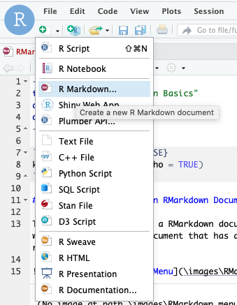
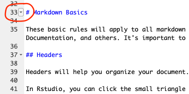
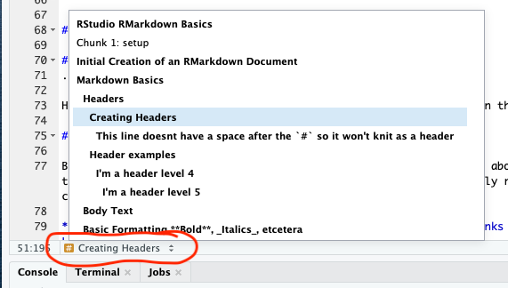

```{r setup, include=FALSE}
knitr::opts_chunk$set(echo = TRUE)

## Set the figures for the RMD to store in a folder
knitr::opts_chunk$set(
  fig.path = "images/")
```

# Initial Creation of an RMarkdown Document

The easiest way to setup a RMarkdown document from scratch is to use the dropdown menu from within RStudio (_see below_). It will start you with a document that has all of the basic "boilerplate" options and will set you up for an easier time down the road.


{height=200px}

Alternatively, just start with an existing document that you like then copy and modify it. This can be a past homework, something that you find on the internet, or this tutorial. This approach will set up the basic "boilerplate" _and_ can often save you from having to look up things (such as arcane LaTeX) later. I used the math review cheat sheet ([link](https://github.com/mids-w203/cheat_sheets)) as the basis for my homework for the entire time that I took w203.


# Markdown Basics

These basic rules will apply to all markdown you work with. Technologies that use markdown include RStudio (duh), Google Colab notebooks, Jupyter Notebooks, Github Documentation, and others. It's important to grok the basics if you want to have professional looking work 

## Headers

Headers will help you organize your document. Some markdown implementations (RStudio included) leverage them to help you navigate around your document. 

In Rstudio, you can click the small triangle next to the header to collapse and uncollapse a section of the document and all subsidiary headers. (_see below_)

{height=150px}

You can also navigate the document using headers using the small `#` box at the bottom of the main document window. (_see below_)

{height=220px}

### Creating Headers 

To create a header put a number of `#`s at the beginning of a line equal to the header level that you would like to use. Follow this by a single space and the actual text of the header. It's important that the first line of the character is the `#` and that there is a space between the `#` and the first character of your header or it won't render.

 ## This line starts with a space and won't knit as a header
 
####This line doesnt have a space after the `#` so it won't knit as a header

### Header examples

"**Header examples**" is a header level 3. , "**Headers**" is a header level 2. "**Markdown Basics**" is a header level 1. Other examples follow below. \


```md
#### I'm a header level 4

##### I'm a header level 5
```

#### I'm a header level 4
 
##### I'm a header level 5
.
 
Header levels 6 and higher don't get rendered in any special way in the knitted pdf version, they may work in the github or jupyter markdown implementations though.

## Body Text

Body text in Markdown is grouped in the same paragraph as the line above. It will actually continue on the same line as the text above unless there's a blank space between the lines. In markdown any number of new lines will be automatically reduced to a single blank line between chunks of text. If you want an explicit newline use the `\` character at the end of a line. 

**Always give a full space between body text elements and code chunks and LaTeX blocks. Probably the number one issue when you can't knit is a body text block next to a LaTeX or code chunk**

```
All on 
line one


On line 2. Same space above and below

On line 3. Snug below \
On line 4. Snug above roomy below\
\

On line 5. All alone.
```

All on 
line one\


On line 2. Same space above and below

On line 3. Snug below \
On line 4. Snug above roomy below\
\

On line 5. All alone.

## Basic Formatting **Bold**, _Italics_, etcetera

Markdown has lots of basic formatting options. It can definitely always be used on general body text like this that you are reading now. I was surprised that I was able to get the "Formatting" in the "**Basic _Formatting_** header to render in italics, but I guess it works. Formatting headers may or may not vary depending on specific markdown implementation. 

There are 3 basic formatting options that you have, **bold**, _italic_, and ~~strikethrough~~. There is no underline option.
You can also mix-and-match formatting styles together. Note that the various formatting characters below must be placed directly next to the first and last letter of the formatted phrase or they will not format properly. See below for examples.\


```md
**I'm bold**

_I'm italicized_

~~I'm struck through~~

**You can _combine_** _formatting marks in whatever_ **_~~strange~~ way_ you** want

** I won't be bold because I have a leading space**
```

**I'm bold**

_I'm italicized_

~~I'm struck through~~

**You can _combine_** _formatting marks in whatever_ **_~~strange~~ way_ you** want

** I won't be bold because I have a leading space**

## Lists and Block Quotes (Heirarchical Structures)

Lists in markdown follow 1 of 2 types. They are unordered or ordered. 

Another way to denote Heirarchy is with the block quote structure. We'll look at that after the lists

### Unordered (Bullet Point) Lists

Use a `-` at the begining of the line to create an unordered list. You can create sub-bullets by providing **2** spaces at the start of the line before your next bullet point. Make sure that you have one space after the `-` before your actual text for  the bullet point.\

```md
-You need a space after the "-"

- Pome Fruits
  - Apples
    - Fuji
    - Honey Crisp
    - Cosmic Crisp
  - pears
    - Bartlett
    - Bosc
- Citrus Fruits
  - Oranges
    - Navel
    - Cara Cara
  - Lemons
 - Inconsistent leading spaceing can lead to unexpected results
```
-You need a space after the "-"

- Pome Fruits
  - Apples
    - Fuji
    - Honey Crisp
    - Cosmic Crisp
  - pears
    - Bartlett
    - Bosc
- Citrus Fruits
  - Oranges
    - Navel
    - Cara Cara
  - Lemons
   - Inconsistent leading spacing can lead to unexpected results

### Ordered (Numbered) Lists

Use a number or a letter followed by a `.` (_such as "`1.`" or "`a.`"_) at the beginning of a line to create an ordered list. You can create sub-item by providing **3** spaces at the start of the line before your next bullet point. Make sure that you have one space after the `.` before your actual text for the list item.

The most helpful/annoying thing about ordered is that they will always number/letter sequentially. Even if you don't want them to.

In the github implementation of markdown (which you WILL use eventually) it's even worse because it forces you to start at 1 every time you get a new list and the letters are coerced into numbers. (_"`a.`" becomes "`1.`" on render_) In those cases, keep in mind the ways that you can disrupt things becomeing explicit ordered lists.\

```md
1.You need a space after the "."
1.or it won't register as a list

**1.** bold numbers don't register as list items

1. one
   - a
2. two
3. three
7. seven
   1. one
      g. g
      a. a
   3. three
      7. seven
      2. two

a. a
   1. one
d. d
c. c
```

1.You need a space after the "."
1.or it won't register as a list

**1.** bold numbers don't register as list items

1. one
   - a
2. two
3. three
7. seven
   1. one
      g. g
      a. a
   3. three
      7. seven
      2. two

a. a
   1. one
d. d
c. c

### Block Quotes

You can set off text, equations, anything using the block quote structure. Block quote is an indented section of the page with a left bar. (_Similar to how email chains are shown dependent on your mail client_).\

```md
> I'm a block quote.

> I'm another block quote

> I'm grouped with the next line.
> I'm appended to the first line.
>
> I'm grouped with the previous line (you'll see the groups in jupyter, github, or html)

> Level 1
>
>> Level 2
>>
>>> Level 3
>>>
>>>> Level 4
>
> * Bullets (or ordered lists) can go in here
>   * Even nested ones
```

> I'm a block quote.

> I'm another block quote

> I'm grouped with the next line.
> I'm appended to the first line.
>
> I'm grouped with the previous line (you'll see the groups in jupyter, github, or html)

> Level 1
>
>> Level 2
>>
>>> Level 3
>>>
>>>> Level 4
>
> * Bullets (or ordered lists) can go in here
>   * Even nested ones


## Code (Monospace) Formatting

Code (monospace formatted text) can be displayed in blocks or inline.  To display code in-line open and close with a single backtick  (backticks are next to the "`1`" key on most keyboards) like so  `` `I'm inline code` ``. To start and then to end a code block, use 3 backticks like so `` ``` `` . If you include a programming language name directly after the backtick as below, it will highlight/color the code as if typed in that language. The extent to which things are highlighted and colored depends on the specific markdown rendering environment.\

```
\```r
# Nicely colored R code
library("data.table")
\```

\```
# r code without the coloring
library("data.table")
\```

\```python
# nicely colored python code
import pandas as pd
\```

\```bash
# nicely colored script
docker run --name rstudio -p 8788:8787 -e PASSWORD=foo rocker/verse:latest
\```
```


```r
# Nicely colored R code
library("data.table")
```

```
# r code without the coloring
library("data.table")
```

```python
# nicely colored python code
import pandas as pd
print("hello world")
```

```bash
# nicely colored script
docker run --name rstudio -p 8788:8787 -e PASSWORD=foo rocker/verse:latest
```

### Links

Including links is easy. They can be to web pages or they can be within document.

If you are linking within a document, you can link to headers. To link to a header just use `#header-name` for the link. Always include the `#`. The `header-name` part should be the name of the header you want to link to in lower case and replace the spaces with hyphens. See the Rstudio Markdown documentation for details ([link](https://rmarkdown.rstudio.com/authoring_pandoc_markdown.html#internal-links)) 

If your output is a pdf, then the links are not very apparent. They only show up as being different than the surrounding text when you hover over them with the mouse. If your final docuemnt is a pdf, you will have to give a stronger indication that there's a link.\

```
Click on this [web link](https://youtu.be/dQw4w9WgXcQ) to see a video of cute puppies

I'm planning on exporting to a pdf I want to make my link apparent ([link is here](https://youtu.be/dQw4w9WgXcQ))

[This will link to the _Code (Monospace) Formatting_ section](#code-monospace-formatting)
```

Click on this [web link](https://youtu.be/dQw4w9WgXcQ) to see a video of cute puppies

I'm planning on exporting to a pdf I want to make my link apparent ([link is here](https://youtu.be/dQw4w9WgXcQ))

[This will link to the _Code (Monospace) Formatting_ section](#code-monospace-formatting)

### Images

Images and links in markdown are both are invoked in similar ways The images have an exclamation point before them. The text in the square brackets becomes the caption when rendered to pdf. It becomes the alt text (what you see on hover) when rendered to html. 

Optionally, you can pass in extra parameters in curly braces. You can set width and/or height. See the RMarkdown documentation ([link](https://rmarkdown.rstudio.com/authoring_pandoc_markdown.html#extension-link_attributes)) or this helpful answer on StackOverflow ([link](https://stackoverflow.com/a/25167279)) if you want more details.\

```
{height=80px}
```

{height=80px}

## Markdown References

- [Documentation for the Rstudio Markdown Documentation. It uses "pandoc" which should be the same implementation used by jupyter, but don't quote me on that (https://rmarkdown.rstudio.com/authoring_pandoc_markdown.html)](https://rmarkdown.rstudio.com/authoring_pandoc_markdown.html)
- [Documentation for github's implementation of markdown. This is a lot lighter weight than the pandoc implementation, but that also means it's quicker to go through. 95% of what you see here is unversally applicable (https://docs.github.com/en/github/writing-on-github/basic-writing-and-formatting-syntax)](https://docs.github.com/en/github/writing-on-github/basic-writing-and-formatting-syntax)

# RMarkdown Evaluated code

In RMarkdown (not typcal markdown, just in RStudio), you can define spaces for code to evaluate either in chunks or in-line in body text. 

## Code chunks

To define a code chunk that gets evaluated, you define the code chunk similar to how you define a block of code for looking at, but you add brackets with `r` and the chunk name (optional) immediately after the opening triple backtick. You can use the chunk names to navigate on the bottom of the main interaction window like you use headers. To execute the entire code in a chunk you can press `Cmd`+`Shift`+`Enter`.

Also note, you can plug other languages (if they're installed in your environment) in instead of `r` and it will run just fine. You don't get all of the advantages of the IDE, but sometimes you might want to run a `bash` command or a line of python. And, you can do that. 

**Its very important that you separate the code chunks from body text with an empty space above and below the code hunk and any body text or headers. This will cause hard to diagnose knitting errors**\

```
\```{r hello r world}
print("hello r world")
\```

\```{python hello python world}
print("hello python world")
# this works in general, but python isn't installed in the default Rstudio 
# environment on datahub, so you can implement it in your own time.
\```

\```{bash hello bash world}
echo hello bash world
\```
```

```{r hello r world}
print("hello r world")
```

```{bash hello bash world}
echo hello bash world
```

### Comments in Code Chunks

Don't put things that you want general readers for your document to see in code comment chunks. In general, even people who are able to read your code, won't look at your comments in your code block unless they are attempting to interpret your code or output. The general body text is easier to read, and it auto- wraps on render. The code  blocks don't auto-wrap and no one will be able to see your long comments in the rendered document.

```{r code comments}
## Inappropriate Code Comment:
# Don't put things that you want general readers for your document to see in code comment chunks. In general, even people who are able to read your code, won't look at your comments in your code block unless they are attempting to interpret your code or output. The general body text is easier to read, and it auto- wraps on render. The code  blocks don't auto-wrap and no one will be able to see your long comments in the rendered document.

## Good Code Comment:
# generate a vector of 5 random numbers from the standard normal distribution
rnorm(5)
```

## Inline Code Evaluation

RMarkdown has the hugely beneficial feature that it can evaluate code in-line. That means that when you are writing reports etc, you don't have to hardcode the values into your response text. They can change slightly with the data. To evaluate code inline is very similar to an inline code formatting chunk, but immediately after the first backtick you put the letter `r` like so.

The drawback of printing numbers inline is that they will often have more decimal precision than you want. I like to address this with the `sprintf()` command as shown below. But you could also use the `round()` command or wahtever. sprintf is nice because it can use scientific notation where `round()` will not.

_Sidenote, it was difficult to get `` `r "\u0060r pi\u0060"` `` to render literally. Luckly there was a blog post that had how to do it.  ([link](https://rviews.rstudio.com/2017/12/04/how-to-show-r-inline-code-blocks-in-r-markdown/))_

```
pi is `r "\u0060r pi\u0060"` 

pi is approximately `r "\u0060r sprintf('%.3f', pi)\u0060"`

pi is approximately `r "\u0060r sprintf('%.2e', pi)\u0060"` in scientific notation
```

pi is `r pi`

pi is approximately `r sprintf("%.3f", pi)`

pi is approximately `r sprintf("%.2e", pi)` in scientific notation

# LaTeX

**The most important thing that you can take away from this section is the link to the "_LaTeX Math for Undergrads_" cheat sheet from the Tex Users Group. I use it probably 3 times a week.  Bookmark it. Save it. Remember to google "tug ctan undergrad math". If you have a specific question about any symbol you can think of. This cheat sheet is succinct and brilliant. ([link](http://tug.ctan.org/info/undergradmath/undergradmath.pdf))**

## Important LaTeX Functions in General

### Grouping in LaTeX

```{r grouping bookmark}
# Dummy code chunk to see where I fail
```

A generally important concept in LaTeX is that curly braces `{}` are used to group objects that are more than 1 character long that you want to operate on. But for single character expressions, the curly braces are optional. 

So `$x^2$` $x^2$ will behave as well as `$x^{2}$` $x^{2}$ but `$x^12$` $x^12$ is very different output than `$x^{12}$` $x^{12}$ 

### Spacing in LaTeX

```{r spacing bookmark}
# Dummy code chunk to see where I fail
```
Spacing doesnt matter in latex expressions. Everything is sqeezed in close by default. White space or lack tehreof is treated the same. This can be annoying sometimes. For example $22$ renders the same as $2   2$. In a maybe less contrived example, the $dx$ is always too close to the function being integrated in an integral. $\int xdx$ If you want to give the function some breathing room, you have to artificially add space with one of the functions below. 

- $\Rightarrow\Leftarrow$ No Space
- $\Rightarrow\,\Leftarrow$ Narrowest Space
- $\Rightarrow\:\Leftarrow$ Narrow Space 
- $\Rightarrow\;\Leftarrow$ Narrowish Space
- $\Rightarrow\quad\Leftarrow$ Big Space
- $\Rightarrow\qquad\Leftarrow$ Bigger Space
- $\Rightarrow\hspace{1cm}\Leftarrow$ Arbitrary Space

### Summation and integration functions

```{r summation bookmark}
# Dummy code chunk to see where I fail
```

Integration: `$\int_{-\infty}^{\infty} f(x)\;dx$` $\int_{-\infty}^{\infty} f(x)\;dx$

[Evaluation Bar](https://math.stackexchange.com/a/52660/818977): $\frac{x^2}{2} \Big|_{x=0}^{x=2} \quad or \quad  \left.\frac{x^2}{2} \right|_{x=0}^{x=2}$

Riemann Sum: `$\sum_{i=1}^n x_i$` $\sum_{i=1}^n x_i$

### Basic Expressions 

```{r basics bookmark}
# Dummy code chunk to see where I fail
```

**All of these can be found in the "LaTeX Math for Undergrads" cheat sheet that I mentioned at the start of the LaTeX section ([link](http://tug.ctan.org/info/undergradmath/undergradmath.pdf))**

- Subscripts and subscripts $x_{ij} \quad x^{15}$
- Fractions $\frac{x}{x+1}$
- Dynamically sized parentheses $\left(\frac{1}{x}\right) \; \left(1/x\right)$
- Roots and Radicals $\sqrt{x} \quad \sqrt[n]{x}$

- That curly l that lools nicer than a regular l $\ell$
- The Real Numbers $\mathbb{R}$
- Infinity $\infty$
- Greek Letters $\alpha , \beta , \gamma, \delta, \Delta, \ldots, \omega, \Omega$

- Equality-ish $\approx \; \equiv \; \propto$
- Inequalities $< \; \leq \; \; > \; \geq$
- Therefores $\therefore \; \rightarrow \; \Rightarrow$
- Intersect and union $\cap \; \cup$
- Dot and Cross Product $\cdot \; \times$

- Hats and bars $\bar{X} \; \overline{X} \; \hat{X} \; \widehat{X}$
- Bold math symbols $x^2 + 5 \quad \boldsymbol{x^2+5}$

## Important Functions Within Blocks

The most important functions within code blocks are `aligned` equations which keep your work easy to follow and `cases` which group elements of piecewise functions. Also, the `\\` which is the newline character.

### Cases

```{r cases bookmark}
# Dummy code chunk to see where I fail
```

Use the `\begin{cases}` and `\end{cases}` wrappers to define piecewise functions

```
$$
f(x) = \begin{cases}
1 & 0\leq x\leq 1\\
0 & otherwise
\end{cases}
$$
```

$$
f(x) = \begin{cases}
1 & 0\leq x\leq 1\\
0 & otherwise
\end{cases}
$$

### Aligned Equations

```{r aligned bookmark}
# Dummy code chunk to see where I fail
```

Use the `\begin{aligned}` and `\end{aligned}` wrappers to define a space where you can write aligned functions

```
$$
f(x) \text{ is a uniform PDF on 0 to 1}\\
\begin{aligned}
\\
\\
E[X] &= \int_{-\infty}^{\infty} x\cdot f(x) dx\\
&=  \int_{-\infty}^{0} x\cdot f(x) dx + \int_{0}^{1} x\cdot f(x) dx + 
    \int_{1}^{\infty} x\cdot f(x) dx\\
&=  \int_{-\infty}^{0} x\cdot 0\; dx + \int_{0}^{1} x\cdot 1\; dx + 
    \int_{1}^{\infty} x\cdot 0\; dx\\
&=  \int_{0}^{1} x \; dx  \\
&= \frac{1}{2} \, x^2 \; \Bigg|_0^1\\
\\
&= \frac{1^2}{2} - \frac{0^2}{2}\\
\\
\\
E[X] &= \frac{1}{2}
\end{aligned}
$$
```

$$
f(x) \text{ is a uniform PDF on 0 to 1}\\
\begin{aligned}
\\
\\
E[X] &= \int_{-\infty}^{\infty} x\cdot f(x) dx\\
&=  \int_{-\infty}^{0} x\cdot f(x) dx + \int_{0}^{1} x\cdot f(x) dx + 
    \int_{1}^{\infty} x\cdot f(x) dx\\
&=  \int_{-\infty}^{0} x\cdot 0\; dx + \int_{0}^{1} x\cdot 1\; dx + 
    \int_{1}^{\infty} x\cdot 0\; dx\\
&=  \int_{0}^{1} x \; dx  \\
&= \frac{1}{2} \, x^2 \; \Bigg|_0^1\\
\\
&= \frac{1^2}{2} - \frac{0^2}{2}\\
\\
\\
E[X] &= \frac{1}{2}
\end{aligned}
$$

## LaTeX Errors

```{r errors bookmark}
# Dummy code chunk to see where I fail
```

The worst part about working with LaTeX in RStudio is the knitting errors that it causes. LaTeX error messages are obscure and unhelpful as a general rule.

Luckily, most of the time the error is attributable to 1 thing, spacing within or adjacent to the LaTeX expressions. The compiler is very picky. It has to do with the intermediate form for how the PDF gets created. Be careful and consistent with your spacing and you'll be fine. 

### LaTeX Error Strategies

Before we get into the most common casuses of errors, let's talk the 3 most important debugging and pre-bugging strategies

1. **Knit Often** - Because the LaTeX knitting errors are so hard to debug, the best thing that you can do is knit often. Then you can firstly, be relatively sure that there is only a single error. Secondly, you will probably know whereabouts the error is. The worst thing is when you've written your whole document and get the inevitable knitting error. In that case, you have no idea how many there are or where they are. 
2. **Locate the Bug with Bisection** - The best (maybe only) effective way to locate a LaTeX bug that I have found is deleting parts of your document until you're able to track the part that's actually causing the bug to be thrown. The algorithm to do so is below. 
   a. Copy your entire Rmd file from RStudio to a local text backup file (in sublime or notepad++ or atom or whatever)
   b. Delete the lower half of your file in Rstudio and try to compile it. If it compiles put the top half of the part you deleted back in and see if that runs. Else, delete the bottom of the remaining half from RStudio and try to run again
   c. Repeat until you have found the LaTeX that is causing your compile issue (it's usually LaTeX. It's sometimes the fact that you didn't put an expty space next to your code chunk)
   d. Figure out what's wrong with your LaTeX (see below) and fix it. 
3. **Try Knitting to HTML** - The most fragile part of the system is the conversion to PDF in particular. The way that RStudio/Pandoc renders HTML is much more robust and less sensitive. If you're truly desperate, just knit to HTML and print to PDF from your browser. Often the final project comes out looking just as good. Sometimes it looks better. The extra sending to PDF step might eventually drive you mad though. 

### Errors from LaTeX Blocks

```{r latex block errors bookmark}
# Dummy code chunk to see where I fail
```

There's 1 main thing that causes knitting errors with LaTeX blocks. 

**Empty lines within the block** - You can't have any completely blank lines within the LaTeX block. It freaks the LaTeX gods out for some reason. If you need blank lines within your block you have to put a `\\` on them to tell LaTeX to render a newline there

```
$$
\text{The blank line below will cause a LaTeX Error}

\begin{aligned}
E &= Mcc\\
&= Mc^2
\end{aligned}
$$
```

Additionally, if you have body text next to the LaTeX block without an empty line before and after, you will cause the LaTeX to render incorretly (it will still knit though.)

```
Body text right next to the LaTeX block causes rendering errors
$$
\begin{aligned}
E &= Mcc\\
&= Mc^2
\end{aligned}
$$
Extra blank lines in a document dont do any harm, but crowding causes errors.
```

Frustratingly in both cases case RStudio will give you a preview of the contents of the LaTeX block just fine. It's only when you actually try to knit that you get errors. 

### Errors from Inline LaTeX

```{r latex inline errors bookmark}
# Dummy code chunk to see where I fail
```

There's 1 main thing that causes knitting errors with LaTeX in-line expressions 

**Leading and trailing spaces within the expression.** - You need to have the `$` right next to the in-line expression. There can't be a space after the opening `$` before you start your expression. There can't be a space before the trailing `$` after your expression. Like with the block errors, Rstudio will still render the inline latex preview just fine even though it won't work. 

```
This expression on the relationship between sine and cosine will cause an error:
$\sin\left(x + \frac{\pi}{2}\right) = \cos(x) $
```

# R 

```{r RLang bookmark}
# Dummy code chunk to see where I fail
```

I didn't have time to prepare for R itself. We can cover it in a different week or we can just have you figure it out on your own time.

- Everything is a vector
- data tables or data frames
- That thing I have bookmarked about slicing in R
  - [http://adv-r.had.co.nz/Subsetting.html](http://adv-r.had.co.nz/Subsetting.html)
- The "." doesn't mean anything
- For, if/else, while, define a function. 
- sample
- pnorm,qnorm, rnorm, dnorm, etc.
- Accessing model objects and the like.

```{r end bookmark}
# Dummy code chunk to see where I fail
```
